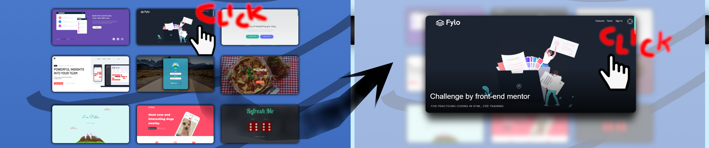
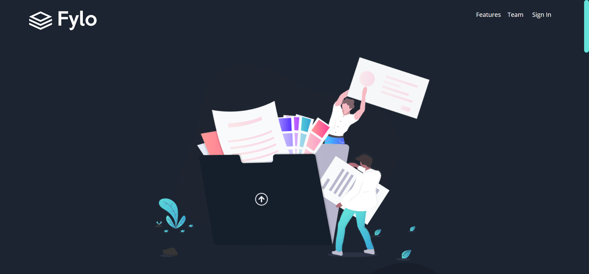
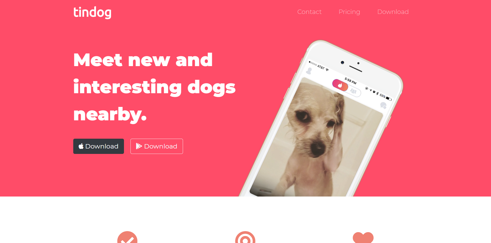

<h1 align="center"><b>PORTFOLIO</b></h1>

## Table of contest

<b>Click to expand</b>

 
* [Main-Page](#Main-page)
* [Front-end](#Front-end)
* [Back-end](#Back-end)
* [Achievements](#Achievements)

 

 
 
<h2 align="center" name="Main-page">Main Page</h2>

<a align="center" href="https://powerful-mountain-48641.herokuapp.com">Link</a> 

The entire main application was created based on Node.Js.\
Uses the services of the cloud platform heroku and
MongoDB – an open, nonrelational database management system.\
The main intention to create this site was to put other websites on one large website.\
To enlarge a photo with a description, click on the thumbnail. \
Then, to go to the page, you have to click once again on the enlarged photo.

   
<h2 align="center" name="Front-end">Front-end</h2>

### Page 1

<a align="center" href="https://powerful-mountain-48641.herokuapp.com/front-end7">Link</a> 

Challenge by front-end mentor.\
For practicing coding in HTML, CSS training.

     

### Page 2

<a align="center" href="https://powerful-mountain-48641.herokuapp.com/front-end8">Link</a> 

Challenge by front-end mentor.\
For practicing coding in HTML, CSS training.

    

### Page 3

<a align="center" href="https://powerful-mountain-48641.herokuapp.com/front-end9">Link</a> 

Challenge by front-end mentor.\
For practicing coding in Sass(CSS), HTML and JavaScript training.

   

### Page 4

<a align="center" href="https://powerful-mountain-48641.herokuapp.com/front-end10">Link</a> 

Challenge by front-end mentor.\
For practicing coding in Sass(CSS), HTML and JavaScript training.

    

### Page 5

<a align="center" href="https://powerful-mountain-48641.herokuapp.com/front-end11">Link</a> 

Admin login page.\
For mobile application in Android Studio.\
Logo design by <a href="github.com/yakzi">yakzi</a>.

   

### Page 6

<a align="center" href="https://powerful-mountain-48641.herokuapp.com/front-end1">Link</a> 

Project for passing internet applications.
It was created in 2018.
Mainly uses bootstrap and jQuery.

   

### Page 7

<a align="center" href="https://powerful-mountain-48641.herokuapp.com/front-end2">Link</a> 

From Angela Yu's online course.
For learning HTML and CSS

    

### Page 8

<a align="center" href="https://powerful-mountain-48641.herokuapp.com/front-end3">Link</a> 

From Angela Yu's online course.
For learning bootstrap, more advanced CSS and using font-awesome

    

### Page 9

<a align="center" href="https://powerful-mountain-48641.herokuapp.com/front-end4">Link</a> 

From Angela Yu's online course.
For learning the basics of JavaScript and DOM.

    

### Page 10

<a align="center" href="https://powerful-mountain-48641.herokuapp.com/front-end5">Link</a> 

From Angela Yu's online course.
For learning JavaScript, key operation and adding sounds.

    

### Page 11

<a align="center" href="https://powerful-mountain-48641.herokuapp.com/front-end6">Link</a> 

From Angela Yu's online course.
A memory game created for learning jQuery.
 
         
<h2 align="center" name="Back-end">Back-end</h2>

### Page 1 

<a align="center" href="https://powerful-mountain-48641.herokuapp.com/back-end1">Link</a> 

From Angela Yu's online course. 
For learning noSQL database, adding posts and using express routing parameters.

    

### Page 2

<a align="center" href="https://powerful-mountain-48641.herokuapp.com/back-end2">Link</a> 

From Angela Yu's online course.
For learning noSQL database.

    

### Page 3

<a align="center" href="https://powerful-mountain-48641.herokuapp.com/back-end3">Link</a> 

From Angela Yu's online course.
For learning application integration with another website, here: mailchimp. 
The data is sent to express a desire to subscribe to the site. 
Who sent and what data only the administrator sees on the mailchimp website.

### Page 4

<a align="center" href="https://powerful-mountain-48641.herokuapp.com/back-end4">Link</a> 

From Angela Yu's online course.
For learning password encryption, session, register, login and indirect login, for example: via Google.

        
<h2 align="center" name="Achievements">Achievements</h2>

 

